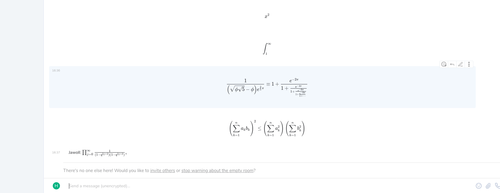

#  Riot/Element KaTeX

This extension injects KaTeX into the `Element` chat client for
`matrix`.

## Writing LaTeX
 - `$$$x^2$$$` renders math block style
 - `$$x^2$$` renders math inline

## Download and Installation
You can download the extension [the firefox addon
store](https://addons.mozilla.org/en-US/firefox/addon/riot-katex/).

## Example

## Building the Extension
 - make sure you have npm installed
 - run `npm install`, the webextension will be zipped as
   `build/katex-riot.zip` and the file structure of the extionsion is
   written to the folder `build/katex-riot-pub` for debugging
 - to clean all build artifacts, just run `npm run clean`

## Thanks
Thanks to [KaTeX](https://katex.org/) for providing the blazingly fast
rendering library for LaTeX formulas.
